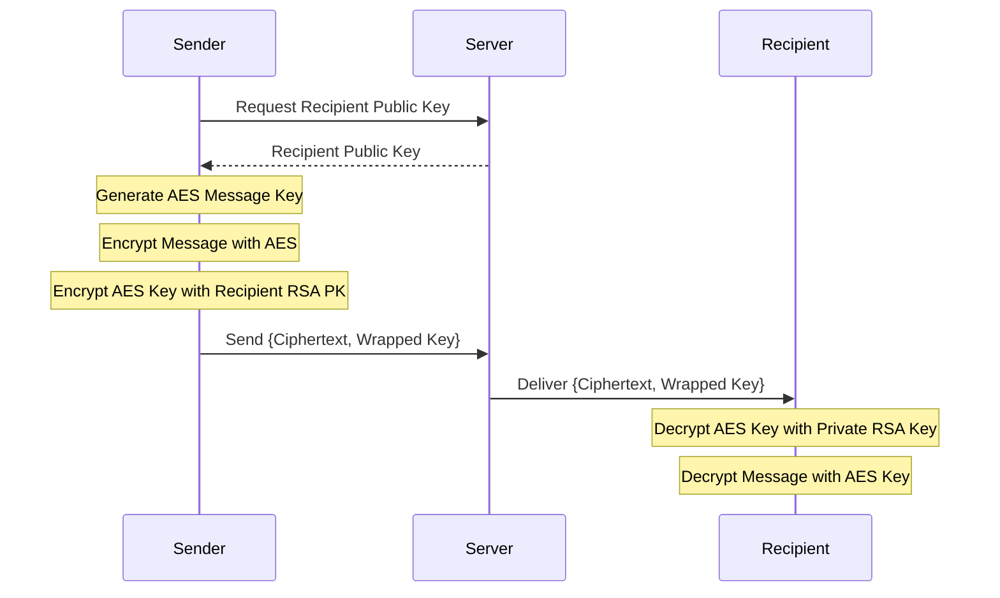

# Flux — End-to-End Encrypted Messaging

Flux is a premium, high-fidelity messaging application built with a **security-first architecture**. It implements full **End-to-End Encryption (E2EE)** using the modern Web Crypto API, ensuring that only the intended recipients can ever read the content of your conversations.

## 🎯 Stage 4B Objective
This project fulfills the requirements for building a secure messaging application where:
- Data is encrypted on the client before transmission.
- The server (Whisperbox) never sees plaintext content.
- Private keys never leave the client in an unencrypted state.

## 🏗 System Architecture

### Frontend (React + TypeScript)
- **Key Generation**: Generates RSA-OAEP 2048-bit key pairs.
- **Key Protection**: Implements PBKDF2 with 100,000 iterations to derive a wrapping key from the user's password.
- **Encryption Engine**: Uses AES-256-GCM for message content and RSA-OAEP for key exchange.
- **Local Storage**: Securely stores the unwrapped private key in memory (state) and wrapped version for session persistence.

### Backend (Whisperbox API)
- **Identity Management**: Stores user profiles and public keys.
- **Message Storage**: Stores only encrypted blobs (ciphertext) and wrapped session keys.
- **Key Exchange**: Facilitates the distribution of public keys to facilitate E2EE.

---

## 🔒 Encryption Flow

### 1. Registration & Key Setup
1. A user registers with a username and password.
2. The client generates an **RSA-OAEP 2048-bit** key pair.
3. The client generates a random **128-bit salt**.
4. The client uses **PBKDF2** (100k iterations) to derive a 256-bit AES key from the password and salt.
5. The **Private Key** is encrypted (wrapped) using this AES key via **AES-GCM**.
6. The **Public Key**, **Wrapped Private Key**, and **Salt** are sent to the server.

### 2. Sending a Message
1. The sender fetches the recipient's **Public Key** from the server.
2. A random **256-bit AES-GCM key** (the "Message Key") is generated.
3. The message content is encrypted with the Message Key and a random IV.
4. The Message Key is encrypted with the **Recipient's Public Key** (RSA-OAEP).
5. The Message Key is also encrypted with the **Sender's Public Key** (so the sender can view their own sent messages).
6. The ciphertext, IV, and the two wrapped keys are sent to the server.



---

## 🔑 Key Management

| Key Type | Algorithm | Storage Location | Purpose |
| :--- | :--- | :--- | :--- |
| **Public Key** | RSA-OAEP (2048) | Server (Public) | Used by others to encrypt message keys for you. |
| **Private Key** | RSA-OAEP (2048) | Client (Secure) | Used to decrypt message keys sent to you. |
| **Wrapping Key**| AES-GCM (256) | In-Memory Only | Derived from password via PBKDF2 to wrap/unwrap the Private Key. |
| **Message Key** | AES-GCM (256) | Ephemeral | Unique per message. Used to encrypt the actual text content. |

---

## 🛡 Security Analysis

### Security Trade-offs
- **Server-Stored Wrapped Private Key**: To allow cross-device access, we store the *wrapped* (encrypted) private key on the server. This makes the system dependent on **password strength**. A weak password could allow an attacker who compromises the database to brute-force the wrapping key and extract the private key.
- **PBKDF2 Iterations**: We use 100,000 iterations to make brute-forcing significantly more expensive, balancing security with client-side performance.

### Known Limitations
- **No Forward Secrecy**: Since we use a single long-term RSA key pair for key wrapping, if the private key is ever compromised, all past messages could potentially be decrypted if the attacker has captured the traffic.
- **Metadata**: While the message content is encrypted, the server still knows who is talking to whom and at what time (Traffic Analysis).

## 🚀 Technology Stack
- **Frontend**: React 18, TypeScript, Tailwind CSS, Framer Motion
- **Crypto**: Web Crypto API (SubtleCrypto)
- **State Management**: Zustand
- **Backend API**: Whisperbox (Koyeb)
- **Deployment**: Vercel

---

## 💻 Getting Started

1. Clone the repository:
   ```bash
   git clone https://github.com/Drk-codey/Flux-app.git
   ```
2. Install dependencies:
   ```bash
   npm install
   ```
3. Run the development server:
   ```bash
   npm run dev
   ```
4. Build for production:
   ```bash
   npm run build
   ```

---
*Created by [Drk-codey](https://github.com/Drk-codey) for the Stage 4B E2EE Frontend Challenge.*
